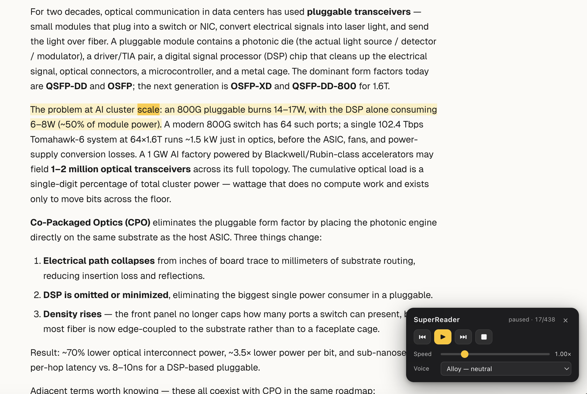

# SuperReader

A Chrome extension that reads any webpage aloud while **highlighting each
sentence and word as it's spoken**. The synchronized audio and text helps
with focus and absorption, and lets you read faster than you would
silently.



## Features

- **Reads articles aloud** — smart content extraction finds the main article
  (`<article>`/`<main>` detection + text-density scoring), skipping nav, ads,
  code blocks, and hidden elements.
- **Synchronized highlighting** — the current sentence is highlighted, and the
  word being spoken is highlighted within it. Uses the CSS Custom Highlight API
  (no DOM mutation, won't break page layout). On a browser without that API
  (pre-Chrome 105) it degrades cleanly to audio-only rather than mutating the
  page.
- **Speed control** — 0.5×–3× via the popup or the in-page widget. Applied with
  `audio.playbackRate`, so changing speed costs no extra API calls.
- **Voice selection** — all OpenAI voices (alloy, ash, ballad, coral, echo,
  fable, nova, onyx, sage, shimmer). Changing voice reloads the current
  sentence live.
- **In-page floating widget** — play/pause/stop/skip without keeping the popup
  open.
- **Reads your selection** — select text first and it reads only that.
- **Gapless playback** — pre-fetches the next two sentences while one plays.
- **Auto-scroll** — keeps the current sentence in view.
- **Keyboard shortcuts** — `Alt+Shift+R` toggle, `Alt+Shift+S` stop.
- **Right-click menu** — "Read this page" / "Read selection".

## Install (unpacked)

1. Open `chrome://extensions` in Chrome.
2. Enable **Developer mode** (top-right).
3. Click **Load unpacked** and select this `superreader/` folder.
4. Click the SuperReader icon → **Options** and paste your OpenAI API key
   (get one at <https://platform.openai.com/api-keys>). Click **Test & save key**.

## Usage

- Click the toolbar icon and press **▶ Read page**, or press `Alt+Shift+R`.
- Or select text on the page, right-click → **Read selection with SuperReader**.
- Use the floating widget (bottom-right) or the popup to pause, skip, change
  speed, or change voice.

## How sync works

OpenAI's TTS API returns audio with no timing data. SuperReader splits the page
into sentences (via `Intl.Segmenter`), sub-splitting any sentence longer than
~1000 chars on clause boundaries so every clip stays short. It requests one
audio clip per sentence. While a clip plays, the word follower maps
`audio.currentTime` to a word by the word's character offset within the
sentence — so the position accounts for spaces and punctuation, not just
letter counts. This gives a smooth word tracker without per-word API calls.

## Files

```
manifest.json            MV3 manifest
background.js            Service worker — OpenAI TTS proxy, commands, context menu
content/
  extractor.js           Article extraction + sentence/word → live DOM Ranges
  highlighter.js         CSS Custom Highlight API wrapper + auto-scroll
  widget.js              Floating in-page control widget
  reader.js              Orchestrator — queue, prefetch, playback, word sync
  content.js             Content-script entry / message router
  styles.css             Highlight + widget styles
popup/                   Toolbar popup UI
options/                 API key + defaults page
lib/utils.js             Shared constants/helpers
```

## Notes & limitations

- Your API key is stored in `chrome.storage.local` and sent only to
  `api.openai.com`. It never enters page context — the service worker makes all
  API calls.
- Restricted pages (`chrome://`, the Chrome Web Store, the PDF viewer) can't be
  read — Chrome blocks content scripts there.
- Each sentence is a separate API call, so reading a long article uses tokens
  accordingly. `tts-1` is the cheapest model; `gpt-4o-mini-tts` is the default.
- The word follower is an interpolation, not exact forced alignment — it tracks
  closely but may drift slightly within very long sentences.
- The placeholder icons in `icons/` are generated; replace them with your own
  artwork if you like.
